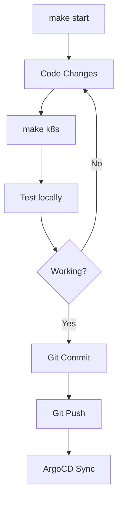
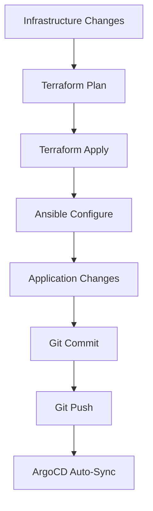

# Local vs Production Configuration

📊 **Comprehensive comparison of local development and production environments**

## 🎯 Quick Overview

| Aspect             | **Local Development**     | **Production**             |
| ------------------ | ------------------------- | -------------------------- |
| **🏠 Environment** | Multipass VM on macOS     | Hetzner Cloud VPS          |
| **🌐 DNS**         | `.local` domains via mDNS | Real domains via DNS       |
| **🔒 SSL**         | Self-signed certificates  | Let's Encrypt certificates |
| **🚪 Access**      | Direct IP + localhost     | Tailscale VPN + public     |
| **📦 Deployment**  | Direct kubectl + ArgoCD   | Full GitOps via ArgoCD     |
| **🔧 Management**  | `make` commands           | Terraform + Ansible        |

---

## 🏗️ Infrastructure Comparison

### Compute Resources

| Component     | **Local**              | **Production**        |
| ------------- | ---------------------- | --------------------- |
| **Host OS**   | macOS (via Multipass)  | Ubuntu 24.04 LTS      |
| **VM/Server** | Ubuntu 24.04 LTS VM    | Hetzner Cloud VPS     |
| **CPU**       | 4 vCPUs (configurable) | 2-4 vCPUs (scalable)  |
| **Memory**    | 8GB (configurable)     | 4-16GB (scalable)     |
| **Storage**   | 20GB (local disk)      | 40-160GB SSD          |
| **Network**   | Private (192.168.64.x) | Public IP + Tailscale |

### Kubernetes Configuration

| Feature          | **Local**              | **Production**      |
| ---------------- | ---------------------- | ------------------- |
| **Distribution** | K3s (lightweight)      | K3s (lightweight)   |
| **Ingress**      | Traefik (built-in)     | Traefik (built-in)  |
| **LoadBalancer** | MetalLB (VM IP)        | Cloud LoadBalancer  |
| **Storage**      | Local path provisioner | Hetzner CSI driver  |
| **Networking**   | Flannel (default)      | Flannel (default)   |
| **Registry**     | Docker Hub (public)    | Docker Hub (public) |

---

## 🌐 Network & DNS Architecture

### DNS Resolution

| Domain Type     | **Local**         | **Production**             |
| --------------- | ----------------- | -------------------------- |
| **Primary**     | `*.local` (mDNS)  | `yourdomain.com`           |
| **ArgoCD**      | `argocd.local`    | `argocd.yourdomain.com`    |
| **Portainer**   | `portainer.local` | `portainer.yourdomain.com` |
| **Apps**        | `app.local`       | `yourdomain.com`           |
| **Resolution**  | mDNS broadcaster  | Real DNS records           |
| **Propagation** | 5-10 seconds      | Instant (cached)           |

### SSL/TLS Certificates

| Aspect         | **Local**                    | **Production**       |
| -------------- | ---------------------------- | -------------------- |
| **Provider**   | Self-signed                  | Let's Encrypt        |
| **Validity**   | 365 days                     | 90 days (auto-renew) |
| **Trust**      | Manual browser accept        | Globally trusted     |
| **SAN**        | `*.local` + specific domains | Real domain names    |
| **Management** | Kubernetes Job               | cert-manager         |
| **Storage**    | Kubernetes secrets           | Kubernetes secrets   |

### Network Access

| Access Method      | **Local**               | **Production**       |
| ------------------ | ----------------------- | -------------------- |
| **Direct**         | `192.168.64.x` (VM IP)  | Public IP            |
| **Secure**         | Host machine only       | Tailscale VPN        |
| **SSH**            | Direct to VM            | Tailscale + firewall |
| **Kubernetes API** | `local-kubeconfig.yaml` | VPN + kubectl        |
| **Web Services**   | `.local` domains        | Real domains         |

---

## 🚀 Deployment & Management

### Deployment Methods

| Operation         | **Local**              | **Production**       |
| ----------------- | ---------------------- | -------------------- |
| **Initial Setup** | `make start`           | `terraform apply`    |
| **App Deploy**    | `make k8s`             | Git push → ArgoCD    |
| **Updates**       | `kubectl apply`        | Git → ArgoCD sync    |
| **Rollback**      | `kubectl` or ArgoCD UI | ArgoCD UI/CLI        |
| **Monitoring**    | `make status`          | Grafana + Prometheus |

### Configuration Management

| Component           | **Local**             | **Production**      |
| ------------------- | --------------------- | ------------------- |
| **Infrastructure**  | Ansible playbooks     | Terraform + Ansible |
| **Kubernetes**      | Direct manifests      | ArgoCD applications |
| **Secrets**         | Local generation      | External secrets    |
| **Config Maps**     | Embedded in manifests | Git repository      |
| **Persistent Data** | VM local storage      | Cloud volumes       |

---

## 🔒 Security Configuration

### Firewall & Network Security

| Security Layer    | **Local**          | **Production**     |
| ----------------- | ------------------ | ------------------ |
| **Host Firewall** | macOS firewall     | UFW (Ubuntu)       |
| **VM Firewall**   | UFW + fail2ban     | UFW + fail2ban     |
| **Network**       | Private VM network | Tailscale mesh VPN |
| **SSH Access**    | Direct to VM       | VPN + key-based    |
| **K8s API**       | Local only         | VPN-restricted     |
| **Web Access**    | Local domains      | VPN + public       |

### Authentication & Authorization

| Service        | **Local**             | **Production**     |
| -------------- | --------------------- | ------------------ |
| **SSH**        | Key-based (generated) | Key-based (secure) |
| **Kubernetes** | Admin kubeconfig      | RBAC + VPN         |
| **ArgoCD**     | Default admin         | SSO/OIDC           |
| **Portainer**  | Local admin           | SSO/LDAP           |
| **Monitoring** | Open access           | SSO/OIDC           |

---

## 📦 Services & Applications

### Core Services

| Service            | **Local**    | **Production** | **Purpose**          |
| ------------------ | ------------ | -------------- | -------------------- |
| **K3s**            | ✅ Latest    | ✅ Latest      | Kubernetes runtime   |
| **Traefik**        | ✅ Built-in  | ✅ Built-in    | Ingress controller   |
| **ArgoCD**         | ✅ Community | ✅ Community   | GitOps deployment    |
| **Portainer**      | ✅ CE        | ✅ CE          | Container management |
| **mDNS Publisher** | ✅ Alpine    | ❌ Not needed  | Local DNS resolution |

### Monitoring & Observability

| Tool                     | **Local**        | **Production** | **Notes**       |
| ------------------------ | ---------------- | -------------- | --------------- |
| **Kubernetes Dashboard** | ❌ Use Portainer | ✅ Optional    | Web UI          |
| **Prometheus**           | ❌ Future        | ✅ Metrics     | Monitoring      |
| **Grafana**              | ❌ Future        | ✅ Dashboards  | Visualization   |
| **Loki**                 | ❌ Future        | ✅ Logs        | Log aggregation |
| **Jaeger**               | ❌ Future        | ✅ Optional    | Tracing         |

---

## 🔧 Development Workflow

### Local Development Cycle

### Production Deployment

---

## 🚨 Key Differences to Remember

### ⚠️ Local-Only Features

- **mDNS Publisher**: Publishes `.local` domains
- **Self-signed TLS**: Browser warnings (accept manually)
- **Direct VM Access**: No VPN required
- **Faster Iteration**: Direct kubectl access

### ⚠️ Production-Only Features

- **Real DNS**: Proper domain resolution
- **Let's Encrypt**: Trusted SSL certificates
- **Tailscale VPN**: Secure remote access
- **Cloud Integration**: Hetzner Cloud APIs
- **Monitoring Stack**: Full observability

### 🔄 Shared Features

- **Identical K8s Manifests**: Same applications
- **ArgoCD GitOps**: Same deployment method
- **Security Hardening**: Same security configs
- **Application Stack**: Same services and versions

---

## 📋 Migration Checklist

### Local → Production Migration

- [ ] Update DNS records to point to production IP
- [ ] Configure Let's Encrypt for SSL certificates
- [ ] Set up Tailscale VPN access
- [ ] Configure external monitoring
- [ ] Update ArgoCD repository URLs
- [ ] Test all application endpoints
- [ ] Verify security configurations
- [ ] Set up backup procedures

### Production → Local Testing

- [ ] Clone production ArgoCD applications
- [ ] Test with `.local` domains
- [ ] Verify SSL certificate generation
- [ ] Test local mDNS resolution
- [ ] Validate application functionality
- [ ] Check resource utilization

---

**Next**: [Architecture Overview](./architecture.md) →
